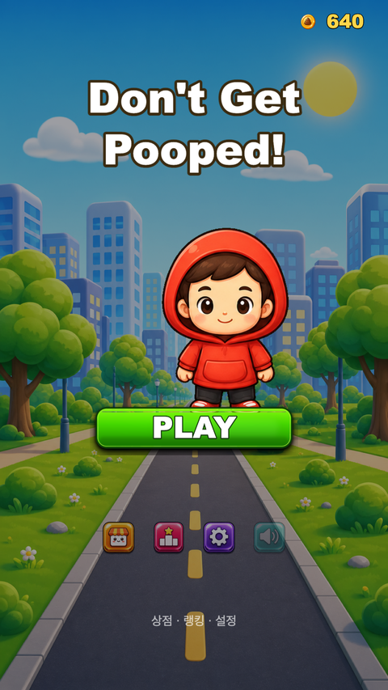
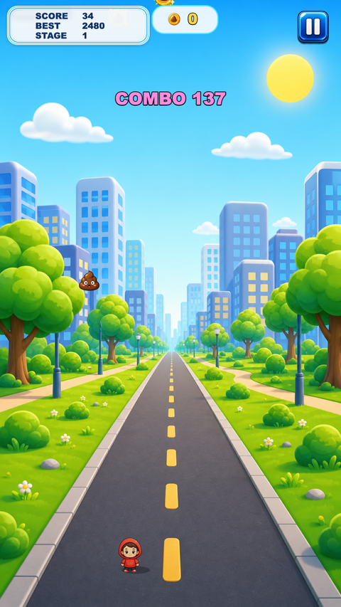
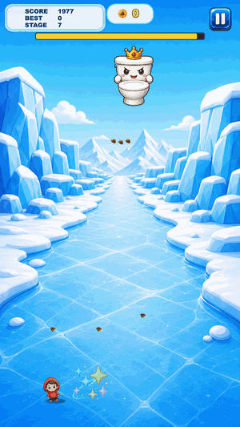

<div align="center">


# 💩 Don't Get Pooped!

[](https://coreline-ai.github.io/mini-web-game/)

[](https://phaser.io/)
[](https://vitejs.dev/)


[](https://github.com/coreline-ai)

**세로형 모바일 아케이드 "똥 피하기" 게임** 🕹️

좌우로만 움직여 위에서 쏟아지는 똥을 피하며 최대한 오래 살아남으세요.
스테이지가 오를수록 미친 난이도 · 파워업 · 3단 보스 · 코인 상점까지.

🎮 **[▶ 브라우저에서 바로 플레이하기 (라이브 데모)](https://coreline-ai.github.io/mini-web-game/)**

<sub>※ GitHub Pages 상시 호스팅 — 언제든 접속 가능합니다.</sub>

[▶ 지금 플레이](https://coreline-ai.github.io/mini-web-game/) · [주요 기능](#-주요-기능) · [스크린샷](#-스크린샷) · [실행 방법](#-실행-방법) · [콘텐츠](#-콘텐츠와-밸런스) · [라이선스](#-라이선스)

</div>

---

## 📸 스크린샷

<div align="center">
<table>
  <tr>
    <td align="center"><br/><b>🏠 첫 화면</b></td>
    <td align="center"><br/><b>🎮 게임 진행</b></td>
    <td align="center"><br/><b>👹 끝판왕 보스전 (플레이 영상)</b></td>
  </tr>
</table>
</div>

---

## Overview

한 손으로 즐기는 세로형 아케이드 회피 게임입니다. 조작은 **좌우 이동뿐**, 규칙은 단순하지만 시간이 지날수록 속도·개수·패턴이 폭발적으로 늘어납니다. 회피로 코인을 모아 캐릭터·배경을 해금하고, 파워업으로 위기를 넘기며, 3단계 변기 보스에 도전하세요.

```text
┌────────┐   PLAY   ┌────────┐  피격   ┌──────────┐  이어하기/재시작   
│  Home  │ ───────▶ │  Game  │ ──────▶ │ GameOver │ ───────────────┐
└────────┘          └────────┘         └──────────┘                │
   │  ▲   상점/랭킹/설정        ▲  스테이지 전환·보스·폭우            │
   ▼  │                        └──────────────── 이어하기(하트/코인) ┘
┌────────────────────────┐
│ Shop · Ranking · Settings │  (코인으로 캐릭터/배경 해금)
└────────────────────────┘
```

---

## 📦 주요 기능

| 기능 | 설명 |
|------|------|
| 🕹️ **한 손 조작** | 마우스 드래그 / 터치로 좌우 이동만 — 하단 15% 영역에서 플레이 |
| 🌪️ **시간 기반 난이도** | 낙하 속도·스폰 간격·동시 개수가 시간에 따라 상승 |
| 🗺️ **8 스테이지 + 배경 전환** | 도시→공원→학교→지하철→우주→사막→빙하→용암 |
| 💩 **8종 똥** | 기본·큰·작은·회전·황금(+500)·새(대각선)·독(바닥잔류)·가짜(페이크) |
| 👹 **3단 보스** | 약한 → 중간 → 강력 변기 보스가 순차 등장, 회피 생존으로 처치 |
| 🍀 **파워업 5종** | 우산(무적)·슬리퍼(속도)·자석(코인)·시계(슬로우)·번개(전멸) |
| 🪙 **코인 & 상점** | 회피/보스로 코인 획득 → 캐릭터 8종·배경 8종 해금 |
| 🔥 **콤보 & Near Miss** | 연속 회피 콤보 배수, 아슬아슬 회피 보너스 |
| ❤️ **이어하기** | 무료 1회 + 코인으로 부활(무적 2초) |
| ⛈️ **폭우 이벤트** | 주기적 경고 후 폭우, 생존 시 보너스 |
| 🔊 **사운드 & 저장** | SFX + 음소거 토글, 코인/스킨/최고점 localStorage 저장 |

---

## 🎮 조작법

| 입력 | 동작 |
|------|------|
| 마우스 드래그 / 터치 | 캐릭터 좌우 이동 |
| 화면 탭 | 시작 · 재시작 · 이어하기 |
| ⏸ 버튼 / `P` · `ESC` | 일시정지 |

> 📱 모바일에서는 두 손가락 동시 입력을 지원해, 이동 중에도 일시정지 버튼을 누를 수 있습니다.

---

## 🚀 실행 방법

### 🎮 라이브 실행 (설치 불필요)

브라우저에서 바로 플레이 👉 **https://coreline-ai.github.io/mini-web-game/**

[](https://coreline-ai.github.io/mini-web-game/)

> GitHub Pages 상시 호스팅 · PC/모바일 브라우저에서 바로 실행됩니다.

### 💻 로컬에서 실행

```bash
npm install       # 의존성 설치
npm run dev       # 개발 서버 (http://localhost:5180, 핫리로드)
npm run build     # dist/ 프로덕션 빌드
npm run preview   # 빌드 결과 미리보기
```

> Vite 개발 서버 포트는 다른 프로젝트와 충돌하지 않도록 **5180**으로 고정되어 있습니다. (`vite.config.js`)

---

## 📁 프로젝트 구조

```text
game-dd/
├── index.html                 # 캔버스 진입점
├── vite.config.js             # publicDir: assets, port 5180
├── src/
│   ├── main.js                # Phaser.Game 생성 + 씬 등록
│   ├── config/gameConfig.js   # ⭐ 모든 밸런스/에셋 상수 (난이도·코인·보스·스테이지)
│   ├── scenes/                # Boot · Home · Shop · Ranking · Settings · Game · Pause · GameOver
│   ├── entities/Player.js     # 선택 캐릭터, 좌우 이동, 원형 히트박스
│   ├── systems/               # 게임 로직 모듈
│   │   ├── PoopSpawner.js      #   똥 오브젝트 풀 + 종류별 스폰
│   │   ├── Difficulty.js       #   시간 기반 난이도 곡선
│   │   ├── StageManager.js     #   스테이지 전환 + 가중치 스폰
│   │   ├── ComboManager.js     #   콤보/배수
│   │   ├── CoinManager.js      #   코인 드롭·자석·수집
│   │   ├── PowerupManager.js   #   파워업 5종
│   │   ├── Boss.js             #   3단 보스
│   │   ├── ScoreManager.js     #   점수(생존+회피+니어미스)
│   │   ├── Effects.js          #   일회성 이펙트
│   │   └── SaveData.js         #   localStorage 저장(코인·스킨·랭킹)
│   └── ui/                     # UiKit, ViewportBackdrop
├── assets/                    # 이미지(imagegen PNG) + 오디오(ogg)
└── docs/                      # 기획·구현계획·시나리오 문서 + 스크린샷
```

---

## 🧱 기술 스택

| 영역 | 사용 기술 |
|------|-----------|
| 엔진 | **Phaser 3** (Arcade Physics, overlap 충돌) |
| 빌드 | **Vite** (`publicDir: assets`) |
| 언어 | **JavaScript (ESM)** |
| 렌더 | 논리 해상도 1080×1920, `Scale.FIT` + `CENTER_BOTH` |
| 성능 | 낙하물 **오브젝트 풀링**, 스프라이트시트 애니메이션 |
| 저장 | `localStorage` (코인·보유 스킨·선택·최고점·랭킹·음소거) |
| 검증 | **Playwright** 헤드리스 자동화 테스트 |

---

## 🗺️ 콘텐츠와 밸런스

모든 수치는 [`src/config/gameConfig.js`](src/config/gameConfig.js) 한 곳에서 조정합니다.

### 스테이지 (시간 기반)

| 스테이지 | 진입 | 배경 | 신규 요소 |
|---|---|---|---|
| 1 | 0s | 도시 | 기본 똥 |
| 2 | 25s | 공원 | 큰 똥 |
| 3 | 50s | 학교 | 작은 똥 |
| 4 | 80s | 지하철 | 회전 똥 |
| 5 | 112s | 우주 | 황금 똥 (+500) |
| 6 | 146s | 사막 | 새 똥 (대각선) |
| 7 | 182s | 빙하 | 독 똥 (바닥 잔류) |
| 8 | 220s | 용암 | 가짜 똥 (페이크) |

### 3단 보스

| 보스 | 등장 | 특징 |
|------|------|------|
| 🟠 약한 보스 | 50s | 단발 → 광폭화 시 3발 부채꼴 |
| 🔴 중간 보스 | 120s | 2발 상시 → 광폭화 시 5발 부채꼴 |
| 🟣 강력 보스 | 195s | 크고 빠름, 3발 상시 → 광폭화 시 **6발 부채꼴** (최상급) |

> 보스는 직접 공격이 아니라 **발사체를 피하며 버티면** HP가 자동 감소해 처치됩니다. 처치 시 점수·코인 보상 후 다음 보스/엔들리스로.

### 파워업 & 상점

| 파워업 | 효과 | | 상점 | 가격(코인) |
|---|---|---|---|---|
| ☂️ 우산 | 10초 무적 | | 캐릭터(최저) | 60 |
| 👟 슬리퍼 | 이동 가속 | | 캐릭터(중/고급) | 200 / 400 |
| 🧲 자석 | 코인 흡수 | | 배경(최저) | 60 |
| ⏰ 시계 | 5초 슬로우 | | 배경(중/고급) | 220 / 400 |
| ⚡ 번개 | 화면 전멸 | | | |

---

## 🧩 확장 & 로드맵 (Extensibility)

이 게임은 **하이브리드 라이브옵스 구조**로 확장할 수 있도록 설계 방향이 정리되어 있습니다:

> **로컬(오프라인) 실행 · 에셋/시나리오의 인터넷(OTA) 업데이트 · 백엔드 연동/공지 수신**

| 단계 | 확장 방향 | 결과 |
|------|-----------|------|
| **0** | PWA화 (서비스워커·매니페스트) | 설치형 · **오프라인 실행** (서버 불필요) |
| **1** | 콘텐츠 원격 manifest + `ContentManager` | 스테이지/보스/에셋 **OTA 업데이트**(재설치 없이) |
| **2** | 정적 공지/리모트 설정 | 인게임 **공지** · 긴급 밸런스 조정 |
| **3** | 백엔드 API(랭킹·세이브·푸시) | 서버 정보교환 · 라이브 이벤트 |
| **4** | Capacitor / Tauri 패키징 | 스토어 · 데스크톱 설치형 |

> ⚠️ **고지:** 위 확장 기능은 **현재 리포에 아직 구현되어 있지 않은 "제안/로드맵"** 입니다.
> 실제 구현·운영은 이 프로젝트를 이어받는 **개발자(사용자)의 몫**이며, 각 단계는 독립적으로 채택할 수 있습니다.
> 아키텍처·연동 지점·스키마·체크리스트 등 **상세 내용은 아래 개발 가이드를 참고하세요.**

💡 **웹 서버 없이 로컬 실행/배포** 방식 비교도 포함되어 있습니다 — 단일 HTML 원파일 · **Tauri**/Electron 데스크톱 앱 · Capacitor 모바일 앱 · PWA · 원클릭 로컬 서버.

📘 **[확장 & 라이브옵스 개발 가이드 → docs/DEV-GUIDE.md](docs/DEV-GUIDE.md)**

---

## 📖 문서

| 문서 | 내용 |
|------|------|
| [docs/DEV-GUIDE.md](docs/DEV-GUIDE.md) | **확장 & 라이브옵스 개발 가이드**(오프라인·OTA·백엔드) |
| [docs/scenario-full.md](docs/scenario-full.md) | 전체 게임 시나리오 · 에셋 활용 맵 |
| [docs/design-spec-supplement.md](docs/design-spec-supplement.md) | 상세 기획 보강(판정·경제·밸런스 수치) |
| [docs/impl-plan-mvp.md](docs/impl-plan-mvp.md) | MVP 구현 계획서 |
| [docs/research/reference-analysis-4-games.md](docs/research/reference-analysis-4-games.md) | Crossy Road · Jetpack Joyride · Survivor.io · Super Hexagon 병렬 분석 |
| [docs/templates/game-production-template.md](docs/templates/game-production-template.md) | 게임 선정 → 시나리오 → 에셋 → 구현 → 테스트 → 배포 표준 프로세스 |
| [docs/templates/game-archetype-recipes.md](docs/templates/game-archetype-recipes.md) | 4개 레퍼런스 구조를 재사용 가능한 제작 레시피로 변환 |
| [docs/templates/common-game-systems-checklist.md](docs/templates/common-game-systems-checklist.md) | 로딩 화면 · 공통 씬 · 저장 · 오디오 · QA Foundation 체크리스트 |

---

## 📜 License

**Copyright © 2026 Coreline-ai. All rights reserved.**

[](LICENSE.md)

This is **proprietary software** and is **not** released under an open-source
license. No rights are granted by default.

Without prior written permission from **Coreline-ai**, you may **not** copy,
modify, distribute, host, deploy, sell, or use this project (or its assets)
for any purpose beyond playing the official live demo.

| Item | Details |
|------|---------|
| 📩 **Licensing & inquiries** | Contact **[Coreline-ai](https://github.com/coreline-ai)** |
| 📄 **Full terms** | See **[LICENSE.md](LICENSE.md)** |
| ▶ **Play (evaluation)** | <https://coreline-ai.github.io/mini-web-game/> |
| 🧩 **Third-party libraries** | Phaser 3, Vite — under their own (MIT) licenses |

> 한국어 안내: 본 프로젝트는 오픈소스가 아니며, 모든 권리는 Coreline-ai에 있습니다.
> 사용·복제·수정·배포·상업적 이용은 [Coreline-ai](https://github.com/coreline-ai) 문의 후 서면 허가가 필요합니다. 전체 조항은 [LICENSE.md](LICENSE.md) 참고.

---

<div align="center">

Made with 🎮 + 💩 · Powered by **Phaser 3**

</div>
