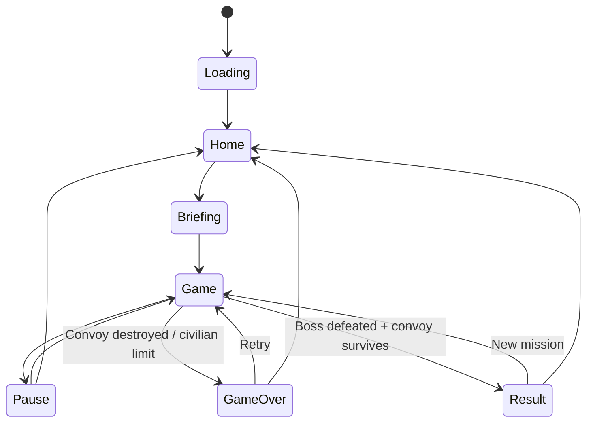

# implement_20260712_104410.md

작성 일시: `2026-07-12 10:44:10 KST`

이 문서는 `Skybreak Gunship`의 90초 도시 구조 임무 Vertical Slice 범위를 고정하고, 조준·사격·호위·부위 파괴·보스전을 production-demo 품질로 구현하기 위한 작업 문서다.

## 개발 목적

- 모바일 세로 화면에서 건십 사수의 정밀 조준과 강한 사격 피드백을 검증한다.
- 자동 스크롤 전장 안에서 구조 차량을 호위하고 적과 민간인을 식별하는 고유 루프를 구현한다.
- 30mm 기관포, 유도 미사일, 장갑차 부위 파괴, 공격 헬기 보스까지 하나의 90초 임무로 완결한다.
- 고해상도 도시 배경과 runtime 전투 오브젝트를 명확히 분리해 화면 중첩과 레이아웃 불안정을 예방한다.
- 단순 회피 게임이나 기존 슈팅 템플릿의 스킨 변경이 아닌 `custom-loop` production-demo를 완성한다.

## 개발 범위

- 게임 ID: `skybreak-gunship`
- Phaser 3 + Vite 기반 모바일 세로형 `custom-loop`
- 논리 화면 `390x844`, 최대 DPR 3, 물리 타깃 `1170x2532`
- 90초 도시 구조 임무 1개
- 전투 단계 4개: 접근, 시가지 호위, 장갑차 교전, 공격 헬기 보스/철수
- 무기 2종: 30mm 기관포, 유도 미사일
- 적 4종: 소총병, 로켓병, 공격 드론, 장갑차
- 보스 1종: 공격 헬기
- 호위 대상 1종: 구조 차량
- 민간인 그룹과 아군 식별/IFF 규칙
- 장갑차 부위 3종: 포탑, 엔진, 차륜
- 보스 약점 2종: 로터 허브, 미사일 포드
- 점수, 정확도, 지원 콤보, 과열, 미사일 탄약, 호위 차량 내구도
- Home, Loading, Mission Briefing, Game, Pause, Result, GameOver
- 전용 고해상도 이미지, BGM, rotor ambience, SFX, scene-first artboard, manifest, QA evidence

## 제외 범위

- EMP, 연막탄, 정밀 레이저의 실제 플레이 구현
- 사막·항만·설원 추가 스테이지
- 건물 파괴 시뮬레이션과 완전한 물리 파편
- 자유 비행, 플레이어 건십 위치 이동, 3D 지형·모델·리깅
- 무기 업그레이드, 상점, 메타 성장, 일일 미션
- 백엔드, 계정, 광고, 결제, 서버 랭킹, 멀티플레이
- Android/iOS 네이티브 패키징과 스토어 출시
- 5분 생존 모드와 무한 웨이브

## 참조 문서

- `/Users/hwanchoi/project_202606/game-dd/.agents/skills/game-factory/SKILL.md`
- `/Users/hwanchoi/project_202606/game-dd/dev_game/docs/new-game-start-guide.md`
- `/Users/hwanchoi/project_202606/game-dd/dev_game/docs/production-demo-quality-contract.md`
- `/Users/hwanchoi/project_202606/game-dd/dev_game/docs/post-production-qa-contract.md`
- `/Users/hwanchoi/project_202606/game-dd/dev_game/docs/ai-art-pipeline.md`
- 사용자 제공 `Skybreak Gunship` 콘셉트 및 첫 Vertical Slice 요구사항

## 공통 진행 규칙

- 각 Phase는 앞선 Phase의 자체 테스트 완료 후에만 시작한다.
- 구현 중 발생한 이슈는 해당 Phase에서 수정하고 기록한다.
- 체크박스 상태를 실제 진행 상태와 맞게 업데이트한다.
- 문서에 없는 범위 확장은 하지 않는다.
- 게임 규칙 수치는 단일 config에서 파생하고 UI/GDD/QA에 중복 하드코딩하지 않는다.
- 전투 판정은 seed 기반으로 재현 가능하게 만들고 QA에서 동일 입력 결과를 비교할 수 있어야 한다.
- 배경에는 적, 구조 차량, 민간인, 총탄, 폭발, 조준점을 굽지 않는다.
- 모든 전투 엔티티는 runtime이 소유하며 논리 엔티티당 visible sprite를 하나만 유지한다.
- 텍스트와 숫자는 런타임에서 렌더링하고 이미지에 UI 문구를 굽지 않는다.
- 조준점, 적 표식, 민간인 표식은 서로 다른 실루엣과 시각 언어를 사용한다.
- 이미지 에셋은 `skybreak-gunship` 전용으로 신규 생성한다.
- 완료 판정은 build가 아니라 실제 브라우저 조작, 캡처 검토, production gate 통과를 기준으로 한다.

## Phase 상태 요약

- [x] Phase 0 완료 — 범위·규칙·아트 소유권 고정
- [x] Phase 1 완료 — custom shell과 화면 계약
- [x] Phase 2 완료 — 조준·30mm 기관포 graybox
- [x] Phase 3 완료 — 적·호위·민간인·웨이브
- [x] Phase 4 완료 — 미사일·부위 파괴·보스
- [x] Phase 5 완료 — 점수·난이도·승패·진행
- [x] Phase 6 완료 — HUD·튜토리얼·오디오·게임 필
- [x] Phase 7 완료 — 전용 고해상도 에셋 통합
- [x] Phase 8 완료 — 실제 브라우저 gameplay QA
- [x] Phase 9 완료 — 후보정·production gate·완료 문서

### 최종 구현 증거

- Full Production Gate: PASS (`2026-07-12T08-28-23-959Z`)
- Captured-state: 36 captures, overlap/out-of-bounds/missing/assertion/browser error 모두 0
- Combat systems: 13 assertions PASS
- Rules/boundaries: 20 assertions PASS
- Input hostility: dual-touch, rapid release, Pause/Resume 10회, visibility auto-pause PASS
- Lifecycle soak: 120초 가속, Retry 5회, tracer 1,000회, scene/audio/pool trend PASS
- 최종 문서: `skybreak-gunship/docs/06-FINAL-QA-SUMMARY.md`, `07-REGRESSION-CHECKLIST.md`

## 핵심 설계 검토 결과

### 제작 판단

- 결정: `custom-loop`
- 이유: 자동 스크롤 전장, 자유 조준, hitscan 기관포, 미사일 lock-on, 호위 AI, 민간인 식별, 부위 파괴, 보스 약점은 기존 dodge/falling Foundation과 핵심 구조가 다르다.
- Foundation은 Boot/Loading/Home/Pause/Result, AudioManager, SaveData, LayoutRegistry의 shell만 참고한다.

### 입력 방식 수정 권고

원안의 `탭=기관포`, `길게 누르기=미사일`은 같은 playfield gesture에 두 무기를 배치해 오발과 입력 지연을 만들 가능성이 높다.

Vertical Slice에서는 다음처럼 분리한다.

| 입력 | 역할 |
|---|---|
| playfield drag | 조준점 이동 |
| GUN 버튼 hold | 30mm 연사, release 시 정지 |
| MISSILE 버튼 hold | 목표 lock 진행 |
| MISSILE 버튼 release | lock 완료 시 발사, 미완료 시 취소 |
| Pause 버튼 | 즉시 무기 입력 차단 후 Pause 진입 |

- 조준 drag와 무기 버튼은 서로 다른 hit zone을 사용한다.
- 첫 포인터는 aim, 두 번째 포인터만 weapon button에 허용한다.
- 한 손 접근성 옵션은 Vertical Slice 이후 `aim assist + auto burst`로 검토하며 현재 범위에는 포함하지 않는다.

### 30초 코어 루프

1. 자동 스크롤로 적·민간인·호위 차량이 전장에 진입한다.
2. 플레이어가 drag로 reticle을 이동해 목표를 식별한다.
3. 경보 형태와 실루엣으로 적/아군/민간인을 구분한다.
4. 기관포 또는 미사일로 위협을 제거한다.
5. 정확도, 부위 파괴, 호위 차량 무피해에 따라 점수와 지원 콤보를 받는다.
6. 과열·탄약·다음 위협 방향을 읽고 다음 목표를 선택한다.

### 1분 쉬운 상태와 5분 혼돈 상태

- 1분 상태: 단일 방향 보병/드론, 느린 장갑차 1대, 민간인과 적이 충분히 분리됨, 구조 차량 HP 70% 이상 유지 가능.
- 5분 확장 상태: 다방향 드론, 장갑차 2대, 재머, 폭우, 민간인 이동, 미사일 경보가 중첩됨.
- 첫 Vertical Slice는 90초이므로 5분 상태는 설계 검토만 남기고 구현하지 않는다.

## 임무 시나리오

### 임무명

`Operation Skybridge — Downtown Extraction`

### 시나리오

지진과 무장 세력의 공격으로 고립된 도심에서 구조 차량이 임시 의료소의 민간인을 수송한다. 건십 사수는 이동 경로를 따라 자동 비행하며 옥상, 도로, 교차로에서 출현하는 적을 제거해야 한다. 마지막 교량 진입 직전 공격 헬기가 출현한다.

### 90초 진행표

| 구간 | 시간 | 내용 | 학습 목표 |
|---|---:|---|---|
| Approach | 0~15초 | 소총병 3, 고정 민간인 그룹 | 조준·기관포·식별 |
| Escort | 15~42초 | 로켓병, 드론, 구조 차량 등장 | 위협 우선순위·호위 |
| Armor Break | 42~65초 | 장갑차 1, 보병 엄폐 | 미사일 lock·부위 파괴 |
| Boss/Extraction | 65~90초 | 공격 헬기, 마지막 드론 웨이브 | 약점 사격·최종 호위 |

### 승리 조건

- 공격 헬기 격추.
- 구조 차량 HP가 1 이상.
- 민간인 오인 사격 누적이 3회 미만.

### 실패 조건

- 구조 차량 HP가 0.
- 민간인 오인 사격 3회.
- 100초 하드 타임아웃 안에 보스를 격추하지 못함.

## 전투·밸런스 초안

### 30mm 기관포

| 항목 | 초안 |
|---|---:|
| 발사 속도 | 초당 10발 |
| 기본 피해 | 12 |
| 약점 배율 | 1.8배 |
| heat 증가 | 발당 4 |
| 냉각 | 비사격 중 초당 24 |
| 과열 기준 | 100 |
| 재활성 기준 | 40 이하 |
| 탄약 | 무제한 |

- 판정은 hitscan으로 처리하고 tracer, shell, impact만 시각화한다.
- 실제 projectile 10개/초 생성 방식은 모바일 성능과 판정 일관성 때문에 사용하지 않는다.

### 유도 미사일

| 항목 | 초안 |
|---|---:|
| 시작 탄약 | 4발 |
| lock 시간 | 650ms |
| 재사용 대기 | 2.8초 |
| 직격 피해 | 180 |
| 폭발 반경 | 54 logical px |
| 민간인 자동 lock | 금지 |

- lock 중 대상이 화면 밖, 사망, 엄폐 상태가 되면 취소한다.
- release 시 lock이 완료되지 않았으면 탄약을 소비하지 않는다.

### 적·목표물

| 엔티티 | HP | 공격 | 점수 | 핵심 규칙 |
|---|---:|---|---:|---|
| 소총병 | 36 | 구조 차량 지속 사격 | 100 | 짧은 노출/엄폐 반복 |
| 로켓병 | 52 | 예고 후 고피해 로켓 | 180 | 최우선 제거 대상 |
| 공격 드론 | 44 | 건십 HUD 방해/기관총 | 150 | 빠른 횡이동 |
| 장갑차 | 420 | 포탑 사격 | 500+부위 | 포탑·엔진·차륜 파괴 |
| 구조 차량 | 1000 | 없음 | 생존 보너스 | 자동 경로 이동 |
| 공격 헬기 | 1200 | 미사일·기관포 | 4000 | 3페이즈, 약점 2종 |

### 부위 파괴

| 부위 | 효과 |
|---|---|
| 장갑차 포탑 | 공격 중단 |
| 장갑차 엔진 | 이동 속도 60% 감소 |
| 장갑차 차륜 | 이동 정지, 본체 피해 보너스 |
| 보스 미사일 포드 | 미사일 패턴 제거 |
| 보스 로터 허브 | 짧은 stun과 2배 피해 창 |

### 점수

- 명중: `+10`
- 적 제거: 소총병 `+100`, 로켓병 `+180`, 드론 `+150`
- 장갑차 부위 파괴: `+250`
- 장갑차 제거: `+500`
- 구조 차량 무피해 구간: `+600`
- 민간인 안전 통과: 그룹당 `+400`
- 보스 격추: `+4000`
- 오인 사격: `-500`, 콤보 초기화
- miss 3회 연속 또는 과열: 콤보 1단계 감소

### 난이도 축

`difficulty = elapsedSeconds + waveIndex + bossPhase`

- 시간 보상이나 점수에 따라 난이도가 다시 낮아지지 않는다.
- 적 spawn과 공격 간격은 elapsed/wave에 따라 단조 증가하는 압박을 가진다.
- 첫 플레이는 seed 고정, 재도전은 3개 검증된 seed 중 하나를 사용한다.

## 화면 구성

| 영역 | 논리 범위 | 역할 |
|---|---|---|
| 상단 HUD | y 0~112 | 점수, 콤보, 시간, convoy HP, heat, missile ammo, pause |
| 전투 playfield | y 116~704 | 자동 스크롤 전장, reticle, 적·민간인·호위 차량 |
| 무기 dock | y 708~844 | GUN, MISSILE, lock/overheat 상태 |

- 조준점은 얇은 cyan corner bracket과 중심 dot만 사용한다.
- 적은 red diamond, 아군은 blue shield, 민간인은 white rescue icon으로 구분한다.
- 색상 외에 실루엣과 아이콘을 함께 사용한다.
- reticle은 적 marker와 같은 완전한 원형/다이아 형태를 사용하지 않는다.
- 손가락이 reticle을 가리지 않도록 실제 aim point를 touch 위치보다 42px 위에 둔다.
- weapon button hit area는 최소 88x68 logical px로 잡는다.

## 기술 구조

```text
skybreak-gunship/
  docs/
    01-GDD.md
    02-TECH-DESIGN.md
    03-ASSET-AUDIO-PLAN.md
    04-QA-PLAN.md
    05-ADVERSARIAL-REVIEW.md
    06-FINAL-QA-SUMMARY.md
    07-REGRESSION-CHECKLIST.md
  src/game/config/
    gunshipConfig.js
    missionDowntown.js
    gameRules.js
  src/game/entities/
    GroundTarget.js
    EnemySoldier.js
    AttackDrone.js
    ArmoredVehicle.js
    RescueConvoy.js
    CivilianGroup.js
    AttackHelicopterBoss.js
  src/game/systems/
    AimSystem.js
    WeaponSystem.js
    HitscanSystem.js
    MissileSystem.js
    HeatSystem.js
    TargetIdentificationSystem.js
    CoverSystem.js
    DamagePartSystem.js
    ConvoyEscortSystem.js
    WaveDirector.js
    MissionDirector.js
    ScoreComboSystem.js
    AudioManager.js
    LayoutRegistry.js
  src/game/ui/
    GunshipHud.js
    ReticleView.js
    WeaponButton.js
    MissionCoach.js
  src/game/scenes/
    BootScene.js
    LoadingScene.js
    HomeScene.js
    BriefingScene.js
    GameScene.js
    PauseScene.js
    ResultScene.js
    GameOverScene.js
  assets/
  qa/
    capture-matrix.json
    gameplay-qa.mjs
    input-hostility-qa.mjs
    long-run-qa.mjs
```

`GameScene`은 orchestration과 렌더 순서만 담당하며 무기, 적 AI, 호위, 점수 공식을 직접 소유하지 않는다.

## 상태 흐름



## 렌더링·충돌 설계

### 레이어

| Depth | 소유 | 예시 |
|---:|---|---|
| -30~-20 | 배경 | 도시, 도로, 정적 건물, 원경 연기 |
| -10~5 | 전경 환경 | 옥상, 엄폐 벽, 도로 장식 |
| 10~30 | runtime entity | 적, convoy, 민간인, 보스 |
| 40~60 | 전투 FX | tracer, explosion, missile trail |
| 70~90 | targeting | IFF marker, reticle, lock ring |
| 100+ | UI | HUD, warning, weapon dock, pause |

### 충돌·판정

- 기관포: reticle 중심의 hitscan + 대상별 hit shape.
- 미사일: pooled homing projectile + explosion radius query.
- 민간인과 아군은 hitscan 판정에 포함하지만 자동 lock 후보에서는 제외한다.
- 엄폐 대상은 cover state일 때 body hit shape를 비활성화하고 노출 부위만 판정한다.
- 보스 약점은 본체 collider와 독립된 part collider를 가진다.
- 화면 밖, inactive, alpha 임계값 미만 엔티티는 판정에서 제외한다.

## 에셋 계획

### Scene-first artboard

- Home: 도심 상공의 건십, 구조 차량과 작전 지도.
- Game approach: 맑은 낮, 넓은 도로와 옥상.
- Game combat: 연기 낀 중심가, 교차로와 엄폐 지형.
- Boss: 황혼 교량 지구, 공격 헬기와 미사일 경보.
- Pause, Result, GameOver 기준 artboard.

### 배경

| ID | 용도 | runtime 목표 |
|---|---|---|
| city-approach | 0~30초 | 1440x3120 WebP 이상 |
| city-conflict | 30~65초 | 1440x3120 WebP 이상 |
| bridge-extraction | 65~90초 | 1440x3120 WebP 이상 |

- 배경은 vertical scrolling tile로 연결 가능한 상·하 여백을 가진다.
- runtime 적·민간인·차량·폭발을 배경에 포함하지 않는다.

### Runtime image assets

- 구조 차량 1종, 민간인 그룹 2종.
- 소총병/로켓병 각 idle, aim, hit frame.
- 공격 드론 2개 방향 frame.
- 장갑차 본체, 포탑, 엔진/차륜 damage overlay.
- 공격 헬기 본체, 로터, 미사일 포드, damage frame.
- 30mm impact, metal spark, dust, explosion, missile trail, warning FX.
- reticle, hostile diamond, friendly shield, civilian rescue, lock ring 아이콘.
- UI panel base와 버튼 base는 9-slice 또는 코드 기반으로 구현한다.

### 에셋 품질 규칙

- 모든 sprite는 최소 10%, 회전·폭발 FX는 12~16% alpha padding을 가진다.
- sheet crop 후 disconnected component, chroma 잔여물, 지나치게 큰 투명 canvas를 검사한다.
- runtime에서는 frame 기반 `setDisplaySize`를 사용하고 원본 canvas 기준 임의 `setScale`로 표시 크기를 덮어쓰지 않는다.
- directional asset은 실제 이동 방향별 frame을 사용하며 음수 scale 반전은 그림자·무기 방향에 문제가 없을 때만 허용한다.
- 주요 sprite의 source frame은 표시 크기 × DPR3 이상이어야 한다.

## 오디오 계획

### BGM/ambient

- `home_command_ambient`
- `gunship_mission_loop`
- `rotor_interior_loop`
- `boss_intercept_layer`

### SFX

- `ui_click`, `mission_start`, `pause`
- `gun_30mm`, `gun_overheat`, `gun_ready`
- `missile_lock_tick`, `missile_lock_complete`, `missile_launch`
- `impact_flesh`, `impact_metal`, `explosion_small`, `explosion_large`
- `convoy_hit`, `civilian_warning`, `target_destroyed`
- `boss_phase`, `mission_clear`, `game_over`

- gameplay BGM과 rotor loop는 각각 전역 handle 1개만 유지한다.
- Pause/background에서 둘 다 일시정지하고 Home/Result에서 정지한다.
- 기관포 사운드는 발당 개별 재생하지 않고 짧은 loop/burst envelope로 중첩을 제한한다.

## 성능 예산

| 항목 | 예산 |
|---|---:|
| 목표 FPS | 60, 중급 모바일 최소 지속 50 |
| 동시 적 | 일반 14, 보스 포함 18 |
| hitscan tracer | 동시 16 |
| 실제 missile | 동시 4 |
| explosion | 동시 8 |
| smoke emitter | 동시 12 |
| particle | 최대 90 |
| pooled target entity | 24 |
| 배경 활성 레이어 | 2 이하 |

- offscreen 엔티티는 update 빈도를 줄이고 공격 판정을 중단한다.
- tracer, impact, explosion, missile은 pool을 사용한다.
- 장갑차·보스 부위 파괴는 별도 고비용 물리 body가 아니라 명시적 hit shape로 계산한다.

## QA 관점

### 핵심 장르 Assertions

- [x] drag가 reticle만 이동시키고 총·미사일을 자동 발사하지 않는다.
- [x] GUN hold 중에만 기관포가 발사되고 release/pointerout/Pause에서 즉시 정지한다.
- [x] heat 100에서 발사가 잠기고 40 이하에서 정확히 한 번 재활성화된다.
- [x] 미사일 lock 미완료 release는 탄약을 소비하지 않는다.
- [x] 미사일 lock 완료 발사는 탄약을 정확히 1만 소비한다.
- [x] 사망·화면 밖·엄폐 목표로 lock이 유지되지 않는다.
- [x] 민간인과 구조 차량은 자동 lock 후보가 아니다.
- [x] 민간인 오인 사격은 점수 감소, 콤보 초기화, 경고 SFX를 동시에 발생시킨다.
- [x] 장갑차 포탑 파괴 후 포탑 공격이 중단된다.
- [x] 보스 미사일 포드 파괴 후 미사일 패턴이 다시 실행되지 않는다.
- [x] convoy HP 0에서 GameOver가 한 번만 시작된다.
- [x] boss 격추와 convoy 생존 조건이 모두 만족될 때만 Result가 열린다.

### 입력 적대 QA

- [x] 실제 dual-touch aim+GUN 입력과 30초 가속 상태에서 pointer ownership이 교차하지 않는다.
- [x] GUN/MISSILE 동시 입력 정책이 문서와 일치한다.
- [x] MISSILE 버튼 10회 빠른 hold/release 후 탄약이 음수가 되지 않는다.
- [x] Pause/Resume 10회 후 gun loop, rotor loop, BGM 인스턴스가 각각 1개 이하이다.
- [x] one-shot PLAY/RETRY와 3회 세션 반복 후 scene stack과 MissionDirector가 하나씩이다.
- [x] visibilitychange 후 자동 Pause되고 거대한 delta로 적이 순간 이동하지 않는다.

### 식별·시각 QA

- [x] reticle, 적 marker, 민간인 marker가 흑백 캡처에서도 형태로 구분된다.
- [x] hostile/friendly/civilian marker가 sprite를 완전히 가리지 않는다.
- [x] tracer와 missile trail이 HUD 뒤에 렌더링된다.
- [x] 폭발 후 lingering FX와 stale lock ring이 0이다.
- [x] 배경에 baked enemy/convoy/civilian이 없다.
- [x] alpha bbox 바깥 disconnected artifact가 0이다.
- [x] 390x844, 430x932, 1080x1920에서 HUD·무기 dock·reticle safe area가 겹치지 않는다.

### 경계값

- [x] 점수: 0, 9999, 999999
- [x] heat: 0, 39, 40, 99, 100
- [x] missile ammo: 0, 1, 4
- [x] convoy HP: 1000, 1, 0
- [x] civilian strikes: 0, 2, 3
- [x] lock progress: 0ms, 649ms, 650ms
- [x] viewport/DPR: 390x844 DPR2, 430x932 DPR3, 1080x1920 DPR1 및 최대 DPR3 backing 정책

### 장시간·회귀 리스크

- [x] 2분 autoplay + Retry 5회 동안 listener/timer/tween/pool active count가 단조 증가하지 않는다.
- [x] home→game→home 3회 후 BGM과 rotor instance가 각각 1개 이하이다.
- [x] corrupted localStorage에서 best score와 sound 설정이 기본값으로 복구된다.
- [x] phase background crossfade 경계에서 seam, 순간 점프, runtime entity 위치 이동이 없다.
- [x] 보스 진입 시 기존 wave timer와 일반 적 공격 timer가 정리된다.

## Phase 0. 범위·규칙·아트 소유권 고정

### 목표

- 구현 전에 Vertical Slice 계약과 모호한 입력/승패 규칙을 확정한다.

### 구현 태스크

- [x] `docs/01-GDD.md`에 피치, 루프, 시나리오, 점수, 승패, 범위를 기록한다.
- [x] `docs/02-TECH-DESIGN.md`에 시스템 책임과 데이터 흐름을 기록한다.
- [x] `docs/03-ASSET-AUDIO-PLAN.md`에 배경/runtime/UI 소유권을 기록한다.
- [x] `docs/04-QA-PLAN.md`에 phase/state capture matrix를 정의한다.
- [x] `docs/05-ADVERSARIAL-REVIEW.md`에서 template reskin 여부를 검토한다.
- [x] EMP/연막/레이저와 추가 지역을 제외 범위로 고정한다.

### 자체 테스트

- [x] 모든 숫자 규칙이 `gameRules.js`의 예정 필드와 1:1 대응한다.
- [x] 배경과 runtime이 같은 논리 엔티티를 동시에 소유하지 않는다.
- [x] 90초 타임라인에 빈 구간과 해결 불가능한 위협 중첩이 없다.

### 이슈 및 수정

- [x] 발견 이슈 검토 및 수정 기록 완료 — `docs/06-FINAL-QA-SUMMARY.md` 참조

### 완료 조건

- [x] 구현 완료
- [x] 자체 테스트 완료
- [x] 다음 Phase 진행 가능

## Phase 1. Custom shell과 화면 계약

### 목표

- gameplay와 무관한 scene lifecycle, DPR, 저장, 오디오, layout 계약을 먼저 안정화한다.

### 구현 태스크

- [x] `skybreak-gunship` custom-shell을 생성한다.
- [x] Boot/Loading/Home/Briefing/Game/Pause/Result/GameOver scene을 연결한다.
- [x] 390x844 논리 좌표와 최대 DPR3 backing store 정책을 적용한다.
- [x] AudioManager, SaveData, LayoutRegistry, one-shot transition button을 구현한다.
- [x] `window.__GAME_RULES__`, `window.__GAME_LAYOUT_BOUNDS__`, `window.__SKYBREAK_QA__` 계약을 정의한다.
- [x] Game scene을 graybox playfield/HUD/weapon dock 세 구역으로 분리한다.

### 자체 테스트

- [x] 모든 scene을 debug adapter로 직접 진입할 수 있다.
- [x] Home→Briefing→Game→Pause→Home 전환에서 scene stack이 중복되지 않는다.
- [x] DPR1/2/3에서 backingScale이 정책과 일치한다.
- [x] canvas, HUD, weapon dock이 safe area 안에 있다.

### 이슈 및 수정

- [x] 발견 이슈 검토 및 수정 기록 완료 — `docs/06-FINAL-QA-SUMMARY.md` 참조

### 완료 조건

- [x] 구현 완료
- [x] 자체 테스트 완료
- [x] 다음 Phase 진행 가능

## Phase 2. 조준·30mm 기관포 Graybox

### 목표

- 정밀하고 즉각적인 조준/사격 감각을 placeholder geometry로 먼저 검증한다.

### 구현 태스크

- [x] AimSystem과 touch offset reticle을 구현한다.
- [x] GUN 버튼의 pointer ownership과 hold/release를 구현한다.
- [x] WeaponSystem 내 hitscan, target hit shape, 16-slot tracer pool을 구현한다.
- [x] HeatSystem과 overheat/ready 전환을 구현한다.
- [x] 고정 dummy target과 moving drone target을 구현한다.
- [x] hit flash, impact, recoil, camera micro-shake를 추가한다.

### 자체 테스트

- [x] 실제 touch/mouse drag로 reticle이 정확히 이동한다.
- [x] GUN release/pointerout/Pause에서 1 frame 안에 발사가 정지한다.
- [x] 초당 발사 수, heat 증가, 냉각 값이 config와 일치한다.
- [x] 1000발 테스트 후 tracer/hit FX pool이 증가하지 않는다.

### 이슈 및 수정

- [x] 발견 이슈 검토 및 수정 기록 완료 — `docs/06-FINAL-QA-SUMMARY.md` 참조

### 완료 조건

- [x] 구현 완료
- [x] 자체 테스트 완료
- [x] 다음 Phase 진행 가능

## Phase 3. 적·호위·민간인·웨이브

### 목표

- 적 제거가 구조 차량 보호와 직접 연결되는 mission loop를 완성한다.

### 구현 태스크

- [x] EnemySoldier와 로켓병의 expose/aim/fire/cover FSM을 구현한다.
- [x] AttackDrone의 횡이동/공격 FSM을 구현한다.
- [x] RescueConvoy 경로, HP, 피격 상태를 구현한다.
- [x] CivilianGroup의 이동/대피 상태와 오인 사격 판정을 구현한다.
- [x] TargetIdentificationSystem과 marker 시각 언어를 구현한다.
- [x] WaveDirector에 0~65초 spawn table을 구현한다.
- [x] MissionCoach에 최초 3개 핵심 안내만 구현한다.

### 자체 테스트

- [x] 적 공격 제거가 convoy 피해 감소로 측정된다.
- [x] 민간인/아군은 missile lock 후보에서 제외된다.
- [x] 보이지 않거나 엄폐한 적이 hitscan에 맞지 않는다.
- [x] deterministic fixed schedule에서 spawn 시간과 위치가 동일하다.

### 이슈 및 수정

- [x] 발견 이슈 검토 및 수정 기록 완료 — `docs/06-FINAL-QA-SUMMARY.md` 참조

### 완료 조건

- [x] 구현 완료
- [x] 자체 테스트 완료
- [x] 다음 Phase 진행 가능

## Phase 4. 미사일·부위 파괴·보스

### 목표

- Vertical Slice의 차별점인 lock-on, 장갑차 부위 파괴, 보스 약점 전투를 구현한다.

### 구현 태스크

- [x] MissileSystem의 lock, cancel, launch, homing, explosion을 구현한다.
- [x] ArmoredVehicle의 포탑/엔진/차륜 part를 구현한다.
- [x] part 파괴 상태와 본체 피해 규칙을 구현한다.
- [x] AttackHelicopterBoss의 3페이즈 FSM을 구현한다.
- [x] 보스 로터 허브와 미사일 포드 약점을 구현한다.
- [x] timer-less MissionDirector로 boss 진입 시 stale wave timer/listener가 없게 한다.

### 자체 테스트

- [x] lock 649ms 취소와 650ms 완료 경계가 정확하다.
- [x] 탄약 1에서 한 번만 발사되고 0에서 lock이 시작되지 않는다.
- [x] part별 파괴 효과가 실제 공격/이동/패턴에 반영된다.
- [x] 보스 약점 hit shape가 이동하는 sprite 좌표를 기준으로 함께 이동한다.

### 이슈 및 수정

- [x] 발견 이슈 검토 및 수정 기록 완료 — `docs/06-FINAL-QA-SUMMARY.md` 참조

### 완료 조건

- [x] 구현 완료
- [x] 자체 테스트 완료
- [x] 다음 Phase 진행 가능

## Phase 5. 점수·난이도·승패·진행

### 목표

- 90초 임무가 성공과 실패 양쪽으로 완결되도록 한다.

### 구현 태스크

- [x] ScoreComboSystem과 accuracy 집계를 구현한다.
- [x] MissionDirector의 4개 구간과 경보를 구현한다.
- [x] convoy/friendly-fire/time failure를 구현한다.
- [x] boss defeat + convoy survive victory를 구현한다.
- [x] Result rank와 GameOver reason을 구현한다.
- [x] best score와 sound 설정을 저장한다.

### 자체 테스트

- [x] 모든 실패 조건과 승리 조건을 debug adapter로 도달할 수 있다.
- [x] terminal transition이 중복 실행되지 않는다.
- [x] 난이도 파라미터가 시간순으로 감소하지 않는다.
- [x] retry 후 score/heat/ammo/convoy/wave/boss 상태가 완전히 초기화된다.

### 이슈 및 수정

- [x] 발견 이슈 검토 및 수정 기록 완료 — `docs/06-FINAL-QA-SUMMARY.md` 참조

### 완료 조건

- [x] 구현 완료
- [x] 자체 테스트 완료
- [x] 다음 Phase 진행 가능

## Phase 6. HUD·튜토리얼·오디오·게임 필

### 목표

- 첫 플레이 이해도와 사격 피드백을 production-demo 수준으로 올린다.

### 구현 태스크

- [x] score/combo/time/convoy/heat/ammo/pause HUD를 구현한다.
- [x] Briefing에서 hostile/friendly/civilian 식별 규칙을 보여준다.
- [x] lock ring, overheat, rocket warning, convoy warning을 구현한다.
- [x] 기관포 burst audio, missile lock audio, rotor/BGM 상태를 구현한다.
- [x] hit flash, recoil, shake, tracer, impact, explosion 강도를 조정한다.
- [x] color-blind에서도 marker가 구분되도록 형태를 검토한다.

### 자체 테스트

- [x] 첫 플레이 사용자가 20초 안에 aim/GUN/MISSILE/식별을 경험한다.
- [x] HUD 숫자 최대 길이에서 overlap이 없다.
- [x] pause/background에서 weapon/rotor/BGM이 정지한다.
- [x] 기관포 연사 30초 후 SFX instance가 누적되지 않는다.

### 이슈 및 수정

- [x] 발견 이슈 검토 및 수정 기록 완료 — `docs/06-FINAL-QA-SUMMARY.md` 참조

### 완료 조건

- [x] 구현 완료
- [x] 자체 테스트 완료
- [x] 다음 Phase 진행 가능

## Phase 7. 전용 고해상도 에셋 통합

### 목표

- 신규 생성한 game-specific assets를 graybox와 교체하고 scene-first 합성을 검증한다.

### 구현 태스크

- [x] Home/Game/Boss/Pause/Result artboard를 생성한다.
- [x] 도시 배경 3종을 1440x3120 이상으로 생성한다.
- [x] 적/convoy/civilian/APC/boss sprite sheet를 생성·분리한다.
- [x] FX와 marker/UI icon sheet를 생성·분리한다.
- [x] alpha bbox, connected component, padding, source size를 검사한다.
- [x] asset-manifest와 slice-map provenance를 기록한다.
- [x] runtime 표시 크기를 frame별 `setDisplaySize`로 고정한다.

### 자체 테스트

- [x] 주요 sprite source frame이 rendered size × DPR3 이상이다.
- [x] disconnected artifact, hollow alpha, clipped edge가 0이다.
- [x] artboard와 runtime recomposition의 주요 요소 위치가 일치한다.
- [x] 배경과 runtime entity가 중복되지 않는다.

### 이슈 및 수정

- [x] 발견 이슈 검토 및 수정 기록 완료 — `docs/06-FINAL-QA-SUMMARY.md` 참조

### 완료 조건

- [x] 구현 완료
- [x] 자체 테스트 완료
- [x] 다음 Phase 진행 가능

## Phase 8. 실제 브라우저 Gameplay QA

### 목표

- 실제 포인터 입력과 모든 주요 상태를 같은 실행에서 캡처·검증한다.

### 구현 태스크

- [x] Loading/Home/Briefing/Approach/Escort/APC/Boss/Pause/GameOver/Result 캡처 matrix를 실행한다.
- [x] aim+GUN+MISSILE 실제 입력 흐름을 자동화한다.
- [x] friendly fire, overheat, lock cancel, part break, victory/failure를 검증한다.
- [x] 390x844, 430x932, 1080x1920 layout을 검증한다.
- [x] DPR1/2/3 backing store와 sprite source size를 검증한다.
- [x] 2분 가속 autoplay + Retry 5회 resource trend를 샘플링한다.
- [x] 동일 세션 screenshots와 state-sample JSON을 저장한다.

### 자체 테스트

- [x] browserErrors/pageErrors/unhandledRejections가 모두 0이다.
- [x] duplicateVisibleEntities와 lingeringTransientGraphics가 0이다.
- [x] activeBgmInstances/rotorInstances가 각각 1 이하이다.
- [x] sceneStackSize와 timer/listener/pool count가 반복 후 증가하지 않는다.

### 이슈 및 수정

- [x] 발견 이슈 검토 및 수정 기록 완료 — `docs/06-FINAL-QA-SUMMARY.md` 참조

### 완료 조건

- [x] 구현 완료
- [x] 자체 테스트 완료
- [x] 다음 Phase 진행 가능

## Phase 9. 후보정·Production Gate·완료 문서

### 목표

- 캡처에서 발견된 문제를 모두 수정하고 production-demo 완료 증거를 남긴다.

### 구현 태스크

- [x] 캡처 증상을 defect class로 분류한다.
- [x] 각 결함을 동일 재현 조건에서 before/fix/after로 닫는다.
- [x] production-demo, image-quality, visual-layout, scene-composite, HQ gate를 실행한다.
- [x] full production gate를 실행한다.
- [x] `06-FINAL-QA-SUMMARY.md`와 `07-REGRESSION-CHECKLIST.md`를 갱신한다.
- [x] 최종 screenshot/contact sheet/state samples를 보존한다.

### 자체 테스트

- [x] 모든 필수 gate가 exit code 0이다.
- [x] severity 1/2 결함이 열려 있지 않다.
- [x] 실제 조준·사격·미사일·호위·보스 완료가 캡처 증거로 존재한다.
- [x] production-demo 미충족 항목이 없다.

### 이슈 및 수정

- [x] 발견 이슈 검토 및 수정 기록 완료 — `docs/06-FINAL-QA-SUMMARY.md` 참조

### 완료 조건

- [x] 구현 완료
- [x] 자체 테스트 완료
- [x] Production-demo 완료 보고 가능

## 최종 완료 명령

```bash
cd /Users/hwanchoi/project_202606/game-dd/dev_game/generated/skybreak-gunship
npm install
npm run build

npm --prefix ../.. run factory:production-demo-qa -- --project generated/skybreak-gunship --require-gpt-imagegen
npm --prefix ../.. run factory:image-quality-qa -- --project generated/skybreak-gunship
npm --prefix ../.. run factory:visual-layout-qa -- --project generated/skybreak-gunship --viewports 390x844,430x932,1080x1920
npm --prefix ../.. run factory:scene-composite-qa -- --project generated/skybreak-gunship --viewports 390x844,430x932,1080x1920
npm --prefix ../.. run factory:hq-screen-quality-qa -- --project generated/skybreak-gunship
npm --prefix ../.. run factory:production-gate -- --project generated/skybreak-gunship --require-gpt-imagegen --viewports 390x844,430x932,1080x1920
```

## 잔여 리스크 / 후속 과제

- 자유 조준과 weapon button의 멀티터치 충돌은 graybox 단계에서 가장 먼저 검증해야 한다.
- 민간인 오인 사격은 강한 차별점이지만 작은 화면에서 불공정하게 느껴질 수 있으므로 식별 가독성이 확보되지 않으면 피해 대신 score/combo penalty로 완화한다.
- 장갑차 part collider와 보스 약점이 이미지 animation과 어긋날 가능성이 높으므로 debug bounds와 production bounds를 분리한다.
- 자동 스크롤 배경 seam이 고해상도 art integration의 핵심 위험이다.
- 기관포 사운드 중첩과 particle 과다는 모바일 성능·피로도 위험이므로 동시 인스턴스 예산을 강제한다.
- EMP/연막/레이저는 90초 루프가 검증된 뒤 두 번째 스테이지 설계에서만 추가한다.
